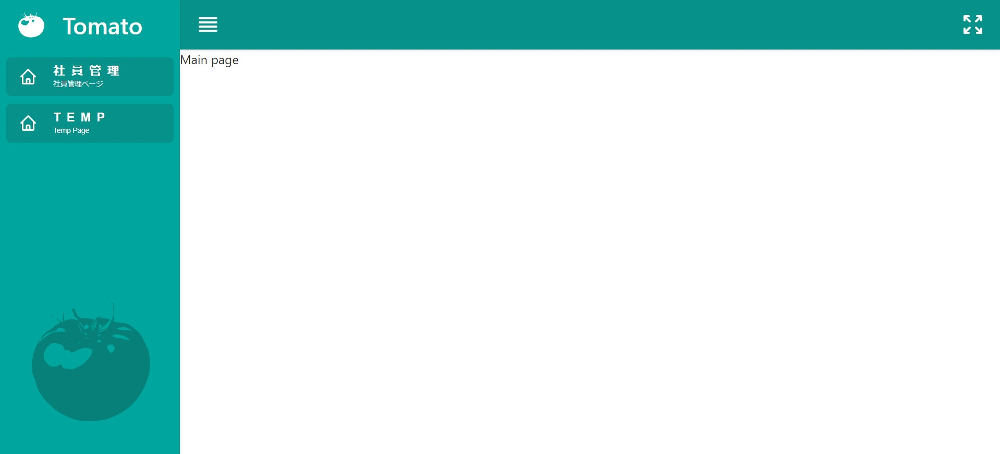

# Tomato React Education Template

<!--  -->

## 설명 - 임시
Fuse-React를 참고, Deprecated된 부분, 실용성이 없는 부분 제외, React 교육 및 웹 애플리케이션 제작에 재사용 가능한 템플릿을 초기 기본 프로젝트에서 시작하여 작성.
- 이걸로 난 React의 신이 되고 말았다.

## 만들게 된 계기
- Fuse-React에 분명 배울 점이 많지만, React를 1년 배우고 많이 해온 나에게만 해당되는 이야기라고 생각.
- 처음 배우는 사람들에겐 이해하기 힘든 기법들 많이 사용.
- 폴더 및 파일 명, naming에 fuse가 너무 많이 들어가서 직관적이지 않음.
- Fuse에서 가르치고자 하는 내용들을 유지 하되, 보다 간결한 템플릿을 작성하고자 함.

## Fuse의 기능적 문제점
1. **Deprecated되거나 대체된 부분들**
   - mui/styles
   - Hidden Component
   - history

2. **실용성이 떨어지는 부분**
   - 정적 Data들을 redux에 보관하는 부분 (NavBar 아이템의 이름)
   - CacheProvider : 언어 방향(rtl, ltr)에서만 유용 - 언어 방향 기능이 실용성 떨어짐.

3. **지나친 설정**
   - custom tailwind 설정이 1500줄, default tailwind에서 크게 벗어나지도 않음
   - 특정 컴포넌트에서만 사용하는 함수를 외부 클래스에 정의 -> useMemo로 대체

4. **사용하지 않는 코드**
   - withReducer 등 - 혼란을 가져올 수 있음.

## 구조
1. **Utils**
   - CustomSuspense: Loading을 띄우기 위해 Customizing
   - ErrorBoundary: 개발 편의성을 위해 (사실 필요 없을 것 같아, 제외 고민 중)
   - Loading: 향상된 사용자 경험을 위한 로딩화면
   - lodash: 객체 결합 시 유용해서 사용.
   - SplashScreen: 향상된 사용자 경험을 위한 스플래쉬 스크린
   - SvgProvider: 코드 재사용성 및 보다 편하게 svg를 사용하기 위함.
   - ThemeProvider: Global로 적용되는 스타일 및 기본 테마 적용.

2. **Config 파일들**
   - 주요 설정인 theme, layout, setting, routes, api의 값 및 환경을 제공하는 파일들.
   - `setting = theme + layout / redux에 주입되어 reducer의 영향을 받아 설정을 관리하도록 하였음.

3. **Main**
   - **apps**: 주요 컨텐츠
   - **components**: header, navbar 등 전역적으로 사용하는 컴포넌트들을 담음
   - **layout**: 화면에 컴포넌트와 app(주요 컨텐츠)를 배치
     - 주요 컨텐츠를 랜더할 때 동적 라우팅을 적용하여 초기 랜더링 시간 단축.
   - **constants**: navbar의 컨텐츠 등 정적 데이터들을 담음

## 주요 기능
1. 동적 라우팅
2. Redux Toolkit
3. 디자인 재사용 성 -> mui theme, material, styled-components
4. 반응형 디자인 - 모바일 화면은 추후 적용 예정.

## 템플릿 사용법
### 메인 컨텐츠 추가의 경우
1. `main/apps/` 경로에 폴더를 만든 후 tsx 파일과 config 파일, 필요하면 내부 컴포넌트 파일 작성 -> temp 컨텐츠 참고
2. config 파일에서 작성한 route를 `routesConfigs` 파일에 추가
3. navbar에 해당 컨텐츠 추가
   - `main/constants/` 경로의 `navBarContents.ts` 파일에 route를 url의 value로 넣어서 작성

### 테마 변경 및 추가의 경우
- `themeConfig.ts` 파일 수정

### 레이아웃 변경 및 추가
- `layoutConfig.ts` 파일 수정

## 추가 예정
- `todo.txt` 파일 참고 (root directory)
